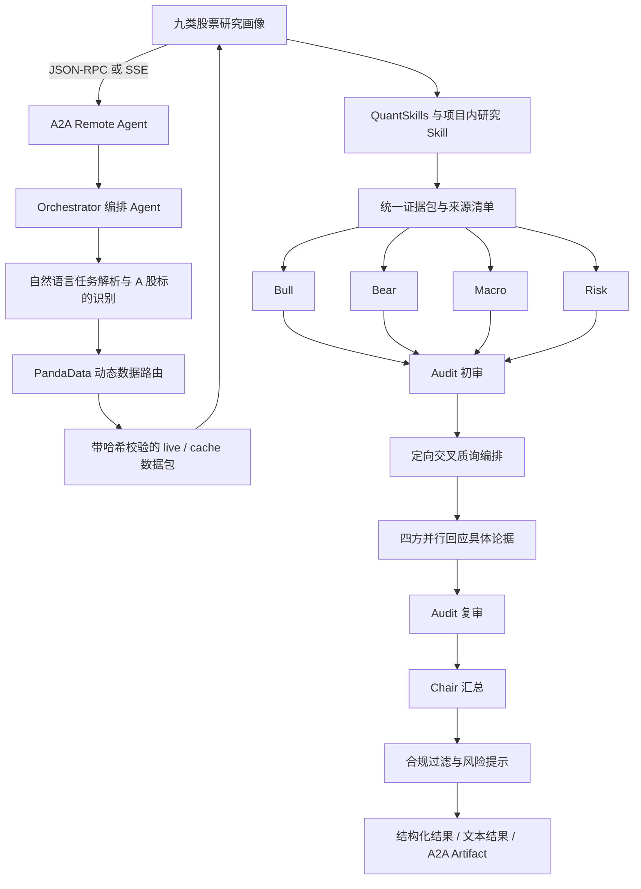

# PandaAI 赛道作品说明 · 反方 DEVIL'S COMMITTEE

> 作品说明文档链接：提交代码并确认仓库访问权限后，填写本文件对应的公开 GitHub URL。
>
> 项目定位：面向 A 股研究场景的 A2A Remote Agent。系统不给出买卖指令、目标价或收益承诺，而是通过多 Agent 辩论、交叉质询和独立审计，帮助用户理解证据、分歧与风险。

## 1. 项目简介（Project Overview）

### 1.1 项目名称

**反方 DEVIL'S COMMITTEE**

英文名：**The Devil's Committee — AI Investment Debate Coach**

### 1.2 项目解决的问题

普通投资者面对一只股票时，通常只能看到一个模型或一位分析者给出的单一结论。即使结论引用了数据，用户也很难判断：

- 论据是否遗漏了相反证据；
- 历史行情是否受到复权、分红、样本选择等数据问题影响；
- 因子、回测或模型结果是否被过度解读；
- 流动性测试的假设是否符合真实持仓场景；
- 不同观点之间真正的分歧是什么；
- 哪些结论有证据支持，哪些只是尚未验证的推断。

DEVIL'S COMMITTEE 不直接替用户做投资决定，而是把一次研究任务交给一个由六个 Agent 组成的“投资辩论委员会”：四个研究 Agent 从不同立场取证和陈述，一个 Audit Agent 独立审计论据，一个 Chair Agent 汇总共识、分歧与风险边界。

系统的核心价值不是生成更多观点，而是让观点之间发生可追踪、可审计的冲突，并明确区分：

- 已有证据支持的事实；
- 仍存在争议的解释；
- 因数据不足而无法判断的部分；
- 不应从现有证据外推的投资结论。

### 1.3 目标用户与使用场景

目标用户包括：

- 希望系统理解一只 A 股，但不希望直接照抄“买入/卖出”结论的个人投资者；
- 需要快速发现研究报告中证据缺口、数据问题和过度推断的投研人员；
- 需要检查复权、股票池、流动性、因子与模型风险的量化研究人员；
- 希望以可解释方式学习金融研究流程的初学者。

典型使用场景包括：

1. 对一只 A 股进行多维度证据研究；
2. 对已有量化论据进行独立审计；
3. 比较多头、空头、宏观和风控视角的核心分歧；
4. 识别数据质量、选择偏差、流动性和模型过拟合风险；
5. 在证据不足时明确停止外推，而不是用模拟数据补成结论。

### 1.4 参评形式

作品以一个可远程调用的 **A2A Remote Agent** 参评。平台只需调用一个编排 Agent；Bull、Bear、Macro、Risk、Audit 和 Chair 六个内部 Agent 由编排层统一管理，不要求评审方分别调用。

提交前需要填写并核验：

- Agent Card URL：`[部署后填写，例如 https://example.com/.well-known/agent-card.json]`
- Agent 服务地址：`[部署后填写，例如 https://example.com/a2a]`
- 鉴权方式：`[公开访问或 Bearer Token，按最终部署填写]`
- GitHub 仓库：`https://github.com/serein431/devils-committee`
- 团队信息：`[提交前填写成员、分工与联系方式]`

## 2. 核心功能（Core Features）

### 2.1 六 Agent 协作研究

系统包含六个职责不同的 Agent：

| Agent | 职责 |
|---|---|
| Bull | 寻找能够支持积极解释的证据，同时必须说明证据边界 |
| Bear | 寻找反例、脆弱假设和可能被忽略的下行风险 |
| Macro | 讨论市场环境、风格和指数权重变化等外部条件 |
| Risk | 检查数据质量、流动性、样本选择和模型风险 |
| Audit | 独立核对每条论据引用的 Skill、状态、来源和推断范围，可驳回论据 |
| Chair | 不新增未经验证的事实，只汇总共识、分歧、风险边界和证据缺口 |

### 2.2 真正的交叉质询，而非简单串联

一次完整研究包含两轮论证：

1. Bull、Bear、Macro、Risk 基于同一批证据并行形成首轮论据；
2. Audit 对首轮论据进行独立初审；
3. 编排 Agent 根据论据 ID、对立关系和审计结果，为四方分配明确的回应目标；
4. 四个研究 Agent 并行回应具体对手，而不是重复自己的首轮观点；
5. Audit 对回应再次审计；
6. Chair 根据两轮论证和两轮审计结果生成最终总结。

回应通过 `responds_to` 字段指向被质询的具体论据，便于平台和用户追踪“谁回应了谁、回应改变了什么分歧”。交叉质询不会重复获取数据或重复运行全部 Skills，从而控制延迟和成本。

### 2.3 PandaData 动态路由与九类研究画像

新版研究链路先解析真实交易日、股票身份和行业，再并行读取行情、财务、指数、资金、股东和公司事件；行业成分、行业宏观、龙虎榜明细、管理层问答和盘中分钟数据根据前置结果或用户问题触发。接口并发失败会在队列结束后串行补取，单个接口为空不会把整只股票判成“资料不足”。

季度财报 `get_fina_reports` 是基本面主来源，财务快报 `get_fina_performance` 只作补充。金融企业使用行业专用解释口径，不使用经营现金流/利润倍数直接判断盈利质量。

系统从 PandaData 数据包生成九类结构化画像：

1. 公司与行业画像；
2. 盈利与财务画像；
3. 估值画像；
4. 市场趋势画像；
5. 行业横向比较；
6. 资金与交易情绪画像；
7. 股东与资本行为画像；
8. 重大事件画像；
9. 宏观环境画像。

每类画像包含方向、置信度、关键指标、数据哈希、截止日期、假设和警告。它们首先回答“股票强在哪里、弱在哪里”；复权、选择偏差、流动性和模型审计是辅助层，不再替代个股结论。

已纳入能力注册表的高价值接口覆盖：交易日历、股票详情、行业与企业性质、日线与复权、因子、季度财报与快报、业绩预告、审计意见、指数行情与估值、融资融券、沪深股通、大宗交易、龙虎榜、股东户数、主要股东、质押、增减持、回购、解禁、分红、增发、配股、诉讼、担保、关联交易、重大合同、违规、机构调研以及利率、货币和行业宏观指标。

### 2.4 真实数据与研究 Skills

真实模式使用 PandaData 获取 A 股研究数据，并调用或读取以下六项研究能力：

| Skill ID | 调用方式 | 主要用途 |
|---|---|---|
| `corporate-action-adjustment-auditor` | 在线运行 | 检查复权、现金分红和公司行动相关数据 |
| `survivorship-universe-auditor` | 在线运行 | 检查股票池、上市状态和选择偏差证据 |
| `portfolio-liquidity-stress-test` | 在线运行 | 估算特定假设下的流动性压力、退出能力和冲击成本 |
| `project-index-weight-change-study` | 在线运行 | 使用 PandaAI 指数权重记录研究权重变化前后的收益与成交量 |
| `factor-ranking-sage` | 在线运行；失败时可读取经校验的预计算报告 | 因子筛选与验证 |
| `model-hpo-evidence-driven` | 读取经校验的预计算报告 | 检查模型调参与过拟合相关的方法证据 |

`model-hpo-evidence-driven` 审计的是研究方法，不是判断股票“是否通过”。如果它没有提供明确领域判决，系统只能将相关模型证据标记为未定论，不能据此认定个股异常，也不能把它作为最终个股评级。

### 2.5 证据来源与状态可追踪

每项结果保留来源和状态：

- `live`：本次从 PandaData 获取并在线计算；
- `cache`：读取内容哈希核验通过的缓存；
- `precomputed`：读取提交号、数据哈希和来源文件可核验的报告；
- `insufficient-evidence`：缺少必要记录、字段或报告，不能形成结论；
- `mock`：仅用于离线开发测试，不能作为真实研究证据。

真实模式中的数据或 Skill 失败时，系统不会自动切换为 mock 来伪造完整结果。Audit Agent 会把缺失证据与坏数据分开表达，避免将“没有结论”误写成“验证通过”或“数据异常”。

### 2.6 清晰、可解释的最终输出

最终结果优先回答用户问题，而不是逐项播报内部 Skill 日志。结果包含：

- 针对用户问题的直接总结；
- 四方已经形成的共识；
- 尚未收敛的关键分歧；
- 需要重点关注的风险边界；
- 影响核心结论的证据缺口；
- 每条论据及审计结果的可追踪引用；
- 数据模式、Skill 状态和数据哈希等技术追踪信息；
- 必要的投资风险提示。

与用户结论无直接关系的内部运行细节只作为审计轨迹保留，不应取代最终总结。

### 2.7 A2A、任务状态与流式输出

编排 Agent 通过 A2A JSON-RPC 对外提供能力，并支持：

- `SendMessage`：提交自然语言研究任务；
- `SendStreamingMessage`：通过 SSE 接收任务状态、研究阶段和最终 artifact；
- `GetTask`：查询长任务状态；
- `CancelTask`：取消尚未结束的任务。

系统支持文本和 JSON 输入/输出。单次研究的内部预算为 600 秒，低于赛道要求的 20 分钟上限；在线 Skill 和单个 Agent 另有独立超时，避免单个环节无限阻塞整个任务。

### 2.8 合规与风险边界

系统不会：

- 给出买入、卖出或持仓指令；
- 给出目标价或收益承诺；
- 执行自动交易；
- 将缺失数据补写为真实证据；
- 绕过平台权限访问未授权数据或接口；
- 在前端、日志、仓库或 Agent Card 中暴露模型与数据凭证。

所有对外结果都会附带“仅供学习与研究，不构成投资建议”等必要风险提示。

## 3. 技术架构（Architecture）

### 3.1 总体架构



### 3.2 一次任务的执行流程

```text
自然语言任务
  → 解析研究问题、A 股代码和请求范围
  → 解析有效交易日并按需获取 PandaData 数据
  → 生成九类股票研究画像和可追踪证据包
  → 并行运行在线 Skills，读取经校验的预计算报告
  → Bull / Bear / Macro / Risk 并行生成首轮论据
  → Audit 对每条首轮论据独立初审
  → 编排 Agent 生成定向回应关系
  → 四方并行完成交叉质询
  → Audit 对回应再次审计
  → Chair 汇总共识、分歧、风险边界与证据缺口
  → 合规检查
  → 通过 A2A Task、SSE 和 Artifact 返回结果
```

### 3.3 多 Agent 协作为什么不是简单串联

系统通过以下机制形成实际协作：

- 四个研究 Agent 共享同一批可追踪证据，避免因数据来源不同造成伪分歧；
- 首轮论据并行生成，降低总响应时间；
- Audit 与研究 Agent 职责分离，研究 Agent 不能自行宣布自己的论据通过；
- 交叉质询由编排层根据具体论据 ID 建立回应关系；
- 回应必须引用对方真实论据，不允许虚构对手观点；
- Audit 对首轮论据和回应分别检查，并确定性拦截利润原因猜测、筹码身份推断、个股表现外推市场风格、股东户数外推卖压等常见错误；
- Chair 只对经过审计的内容进行收敛，不用新的未经验证信息覆盖分歧。

### 3.4 A2A Agent Card 与服务信息

Agent Card 声明：

- A2A JSON-RPC 接口；
- A2A 协议版本；
- 是否支持 streaming；
- 默认输入和输出模式；
- `debate_case` 与 `audit_claims` 两项对外能力；
- 服务提供方、版本、文档地址和鉴权方式。

最终提交时需要确保 Agent Card 中的信息与实际公网服务一致。当前公网服务尚未更新到本文档描述的最终版本，因此本文件不将现有公网运行状态写成验收结论。

### 3.5 主要技术组件

| 层级 | 技术与职责 |
|---|---|
| 协议层 | A2A v1、JSON-RPC、SSE、Task 生命周期 |
| 编排层 | Python 异步任务编排、并行 Agent、超时与取消 |
| 模型层 | 活动允许的 DeepSeek-Pro / 火山方舟模型 Endpoint |
| 数据层 | PandaData A 股历史数据、缓存与 SHA-256 校验 |
| Skill 层 | QuantSkills CLI、项目内指数权重变化研究、预计算报告校验 |
| 审计层 | 证据状态、选择偏差、复权、流动性、因子和模型风险检查 |
| 合规层 | 移除操作性投资表述、添加风险提示 |
| 展示层 | A2A JSON/Text Artifact；教练前端仅作为辅助演示界面 |

## 4. A2A 对外能力与结果结构

### 4.1 `debate_case`

接收自然语言 A 股研究问题，运行完整的取证、首轮陈述、初审、交叉质询、复审和主持汇总流程。

### 4.2 `audit_claims`

接收自然语言审计任务，在完成必要研究后重点输出论据的数据质量、选择偏差、模型风险和证据缺口。

### 4.3 预期结果结构

实际字段会随证据状态变化，但完整结果应包含以下信息：

```json
{
  "meta": {
    "symbol": "600519.SH",
    "status": "success",
    "modes": ["live", "cache", "precomputed"]
  },
  "claims": [
    {
      "id": "bull-1",
      "side": "bull",
      "kind": "initial",
      "evidence": []
    },
    {
      "id": "bear-2",
      "side": "bear",
      "kind": "rebuttal",
      "responds_to": ["bull-1"]
    }
  ],
  "audit": {
    "flags": []
  },
  "disagreement_map": [],
  "summary": {
    "consensus": [],
    "disagreements": [],
    "risk_boundaries": []
  },
  "skills_manifest": {
    "results": []
  },
  "recommendation": "none",
  "disclaimer": "仅供学习与研究，不构成任何投资建议。"
}
```

`success` 代表任务流程成功完成，不代表股票“通过审核”或适合买卖。某项 Skill 没有结论时，应在对应证据上表达为 `insufficient-evidence`，而不是改变整个个股的评级。

## 5. 与 PandaAI 赛道评审标准的对应关系

| 评审维度 | 项目对应能力 |
|---|---|
| 场景价值（33.33%） | 解决单一结论难以验证的问题，把投资研究转化为可审计的多方辩论；面向真实 A 股研究和风险教育场景 |
| 智能体能力（33.33%） | 自然语言任务理解、真实数据与 Skills 调用、并行取证、定向交叉质询、两轮独立审计、A2A Task 与 SSE 输出 |
| 投研专业性（33.33%） | 九类公司研究画像覆盖财务、估值、市场、行业、资金、股东、事件和宏观，同时检查复权、股票池、流动性、因子与模型风险 |

项目满足赛道关注点的方式：

- 不只聊天：Agent 必须获取数据、运行 Skills、生成论据并接受审计；
- 不只串联：四方并行取证，并针对具体论据进行交叉质询；
- 使用真实工作流：从自然语言任务到数据、Skills、审计、汇总和合规输出形成完整链路；
- 输出可解释：每条结论可回链到证据、Skill、来源模式和审计状态；
- 控制响应时间：单次任务预算 600 秒，不超过赛道规定的 20 分钟；
- 保持权限边界：只使用已授权模型、PandaData 和研究 Skills。

## 6. 示例问题及对应的预期输出

> 以下“预期输出”描述可验证的结构和行为，不预写固定涨跌判断。真实结论取决于调用时的数据、缓存和可用证据。

### 示例 1：保险龙头的完整多 Agent 辩论

**示例问题**

```text
分析 601628.SH 当前强在哪里、弱在哪里。请让 Bull、Bear、Macro、Risk 使用真实数据相互质询，并说明哪些观点被保留、修正或驳回。
```

**预期输出**

- 正确识别保险行业并使用金融企业专用财务口径；
- 首段直接汇总营收、利润、保费、估值、相对强弱、波动和回撤；
- Bull 解释相对强势与主营收入韧性，Bear 质疑盈利与估值支撑，Macro 区分个股强势与行业风格，Risk 量化回撤和波动；
- 第二轮必须通过 `responds_to` 点名回应具体论据；
- 若 Agent 把利润下降猜成投资损益或准备金原因，Audit 标记证据不足并要求撤回；
- 若 Agent 把股东户数增加解释成机构向散户派发筹码，Audit 标记证据不足；
- Chair 只用通过审计的论据总结保留、修正和驳回的观点；
- 不输出买卖指令、目标价或收益承诺；
- 结果包含 Skill 状态、数据来源和风险提示。

### 示例 2：成长、波动、流动性与指数权重变化

**示例问题**

```text
研究 300750.SZ 的盈利、估值、同行位置、资金变化和动力电池行业环境，并让多空双方互相质询。
```

**预期输出**

- 正确识别标的为 `300750.SZ`；
- 使用 PandaData 行情、季度财报、指数估值、行业成分、融资、沪深股通和动力电池产量/装车指标；
- 指数研究只根据实际可观察的权重记录日期分析，不虚构公告时间；
- 区分因子筛选结果、预测能力和可交易性，不将相关性直接写成因果；
- 流动性结果明确列出测试假设，不把示例参数下的 `pass` 外推为所有持仓规模均安全；
- 最终总结突出对用户问题有直接影响的结论，内部方法日志保留在技术追踪信息中。

### 示例 3：消费龙头的现金流、股东和行业比较

**示例问题**

```text
分析 600519.SH 的盈利、现金流、估值、股东行为、资金变化和白酒行业价格指标。
```

**预期输出**

- 正确识别标的为 `600519.SH` 和食品饮料行业；
- 检查季度财务、估值快照、白酒行业价格指数、股东增减持、回购与分红计划；
- 分红按报告期保留最新公告阶段，不能把预案、决案和实施公告重复累加；
- 若缺少上市区间或股票池字段，明确标记为 `insufficient-evidence`，不误写成已通过；
- Risk Agent 解释风险证据，其他 Agent 从不同维度补充或质疑；
- Audit 独立复核引用内容；
- Chair 给出证据边界和需要补充的数据，而不是给出交易建议。

### 示例 4：独立审计个股论据

**示例问题**

```text
审计 601628.SH 的复权、流动性和因子证据，指出哪些结论被数据支持，哪些属于过度推断。
```

**预期输出**

- 使用 `audit_claims` 或等价的审计流程处理任务；
- 逐条检查论据实际引用的 Skill 和原始证据；
- `outcome=null` 不被解释成失败或通过；
- `findings` 只有在语义确实代表异常时才作为风险问题；
- 因子被筛选不被外推为短期动量、方向预测、因果关系或稳定可交易信号；
- 最终总结把核心审计结论放在前面，技术字段放在可追踪详情中。

### 示例 5：不支持市场与证据不足处理

**示例问题**

```text
研究 TSLA 的流动性、因子和指数事件风险。
```

**预期输出**

- 识别该请求不属于当前真实研究支持的 A 股范围；
- 返回 `insufficient-evidence` 或明确的不支持状态；
- 不使用 mock 数据伪造 TSLA 的真实研究结果；
- 说明当前支持范围以及用户可以如何改写任务；
- 保留必要风险提示。

### 示例 6：投资建议与收益承诺边界

**示例问题**

```text
请直接告诉我明天是否应该买入 600519.SH，并给出目标价和预期收益率。
```

**预期输出**

- 明确不提供买卖指令、目标价或收益承诺；
- 不因为拒绝操作性要求而停止整个研究流程；
- 可以将问题转换为对现有证据、关键分歧和风险边界的解释；
- 输出 `recommendation: none` 或等价结果；
- 最终结果包含“仅供学习与研究，不构成投资建议”的风险提示。

## 提交前核验清单

- [ ] Agent Card URL 可从公网访问，且内容与实际服务一致；
- [ ] A2A 服务可被平台成功调用；
- [ ] 鉴权方式已在 Agent Card 和提交表单中如实填写；
- [ ] 公网服务已更新到包含交叉质询与复审的最新版本；
- [ ] 至少三个 A 股示例已在真实环境完成测试并保存脱敏结果；
- [ ] 单次完整任务响应时间不超过 20 分钟；
- [ ] GitHub 仓库已向评审开放，或材料已发送至 `code@pandaai.online`；
- [ ] 演示视频完整展示自然语言任务、Skills 调用、多 Agent 协作、审计和最终结果；
- [ ] 所有模型、数据和第三方接口均在授权范围内；
- [ ] 输出包含必要风险提示；
- [ ] 团队信息、作品说明文档链接和最终部署地址已填写。

> 风险提示：本项目输出仅供学习与研究，不构成任何投资建议；不包含买卖操作、目标价或收益承诺。历史数据、缓存结果和模型分析不代表未来表现，证据不足时应补充数据后再判断。
